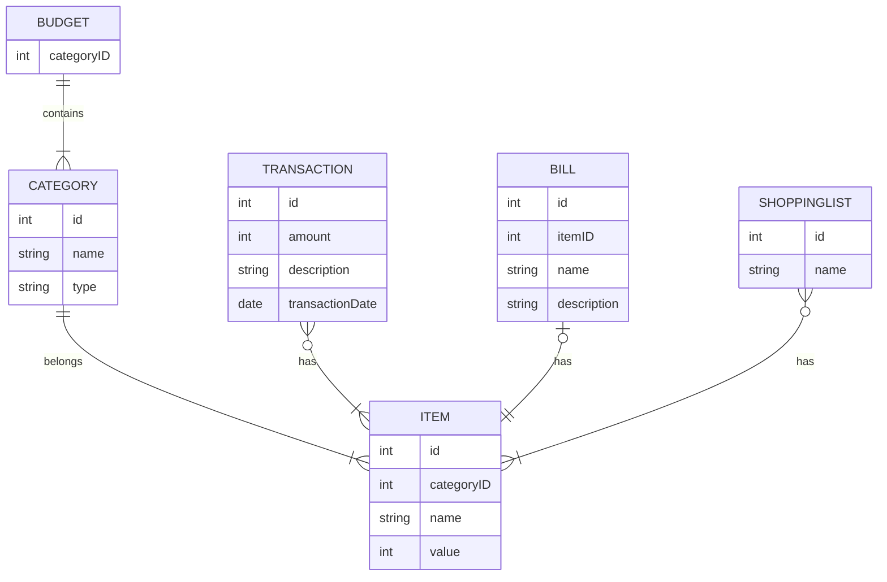

Database schema

```mermaid
erDiagram
    CATEGORY {
        int id
        string name
        string type
    }
    BUDGET {
        int categoryID
    }
    ITEM {
        int id
        int categoryID
        string name
        int value
    }
    TRANSACTION {
        int id
        int amount
        string description
        date transactionDate
    }
    SHOPPINGLIST {
        int id
        string name
    }
    BILL {
        int id
        int itemID
        string name
        string description
    }
CATEGORY ||--|{ ITEM: belongs
TRANSACTION }o--|{ ITEM: has
BILL |o--|| ITEM: has
SHOPPINGLIST }o--|{ ITEM: has
BUDGET ||--|{ CATEGORY: contains 
```
